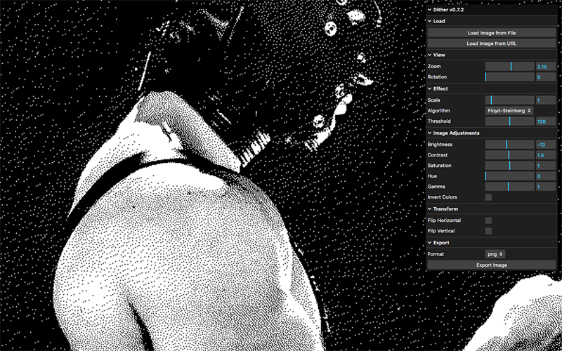

# Dither Tool v0.7.3

An interactive web application for applying various dithering algorithms to images, featuring real-time adjustments, preview scaling, and export capabilities.

## Features

*   **Multiple Dithering Algorithms:** Floyd-Steinberg, Atkinson, Sierra Lite, Ordered Bayer.
*   **Image Adjustments:** Brightness, Contrast, Saturation, Hue, Gamma, Invert Colors.
*   **Transformations:** Horizontal and Vertical Flip.
*   **Preview Controls:**
    *   **Zoom:** Adjust the visual size of the preview.
    *   **Pan:** Drag the image to navigate when zoomed in.
    *   **Rotation:** Rotate the image preview (0°, 90°, 180°, 270°).
    *   **Image Scale:** Scale the *internal resolution* of the image *before* applying dithering and adjustments. This changes the final output size and detail level.
*   **Export Options:** Save the processed image as PNG or JPG via button click or the `S` key.
*   **Load Images:** Upload from your device or paste an image URL.
*   **User Interface:** Clean, floating control panel using `lil-gui`.

## Usage

1.  **Load an Image:** Use the "Load Image from File" button or "Load Image from URL" button in the control panel.
2.  **Adjust Parameters:** Modify settings in the side panel (Effect, Image Adjustments, Transform, Export).
3.  **Preview Changes:** See adjustments applied in real-time (processing might take a moment for large images or high scale factors).
4.  **Navigate Preview:** Use the mouse to pan (drag) and the Zoom slider to adjust the preview size.
5.  **Export:** Click the "Export Image" button or press the `S` key to save the final image with the current settings.

## Development

This project is built using `p5.js` for image processing and canvas manipulation, and `lil-gui` for the control panel interface.

## Contributing

Feedback and contributions are welcome! Please feel free to open an issue or submit a pull request.

## Contact

For bug reports or suggestions, contact: [contact@alejandromunoz.com.ar](mailto:contact@alejandromunoz.com.ar)
